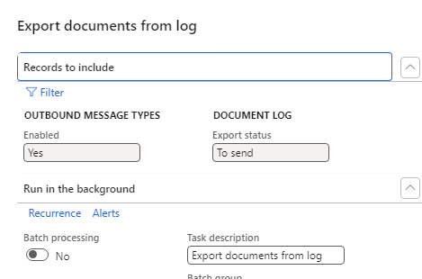
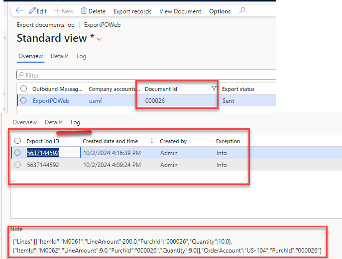
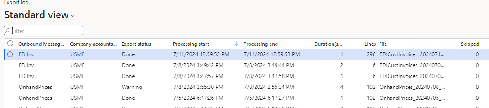
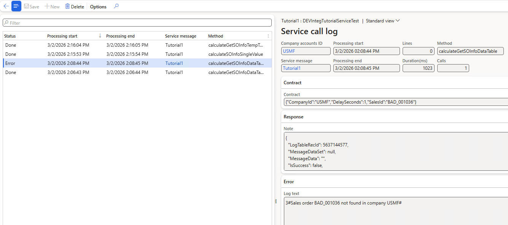

# Log forms

Logging is a first-class feature of the framework: successful runs are logged, not only failures. All log forms are under **External integration → Inquiries**.

## Export document log

*Form: `DEVIntegExportDocumentLog`*

The log for **event-based** outbound integrations. When a business event happens (for example, a purchase order confirmation), a record with a reference to the source document is created here with status **To send**. The *Export messages from log* periodic operation (or an immediate call in the user session) sends the payload and flips the status to **Sent**.

Design notes:

- There are deliberately only two statuses — **To send** and **Sent**. A failed export stays in *To send* with an attached error log; from a business point of view "not exported yet" and "export failed" need the same attention. Set up alerting on records staying in *To send* longer than your threshold.
- With full logging enabled, the exact message body sent to the external system is stored on the log record.
- The **Document ID** field gives the full export history of one document — the tool for investigating "the receiver says it never arrived" cases.

## Export log (bulk)

*Form: `DEVIntegExportBulkLog`*

The log for **periodic (bulk)** exports: one record per run with the generated file name, number of exported lines, duration, and warning/skipped counters.

## Last load call log

*Form: `DEVIntegLastLoadCallLog`*

Diagnostic history of *Load messages* calls per inbound message type — when the last load ran and what it returned. Combined with an alert on the message type's **Last date time** field, it detects both a failing load job and a load job that silently stopped running.

## Service call log

*Form: `DEVIntegServiceExportLog`*

The log for [service message types](./setup/service-message-types.md). The logging level is configurable per service:

- **None** — no logging.
- **Statistics & Errors** — one summary record per day for successful calls (total calls and lines), plus a detailed record for every failed call.
- **Errors only** — detailed records only for failures.
- **Request** — also stores the incoming request parameters.
- **Full logging** — stores requests and full responses.

Statistics-based levels keep the log compact for high-frequency services while still giving daily volume numbers for monitoring.
