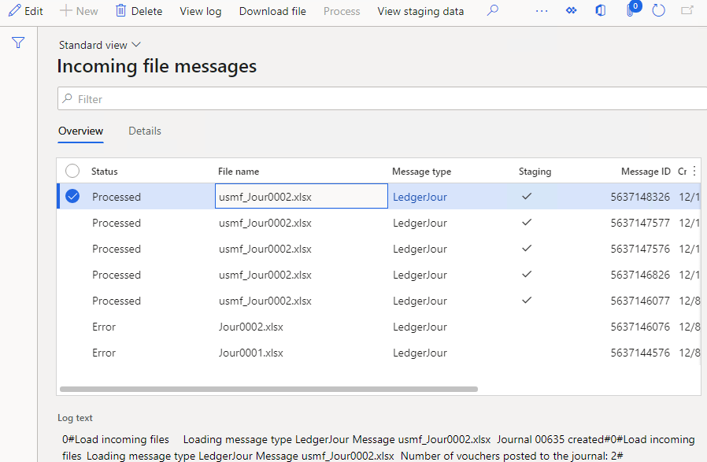
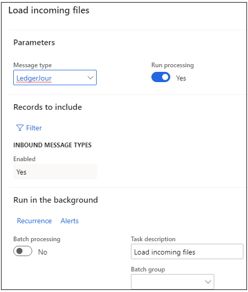
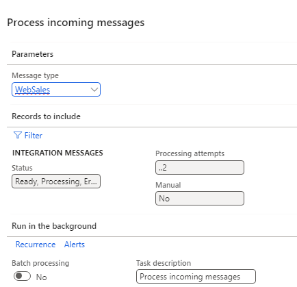
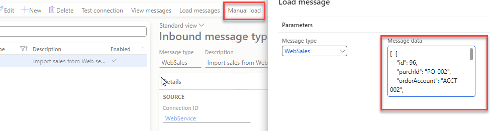
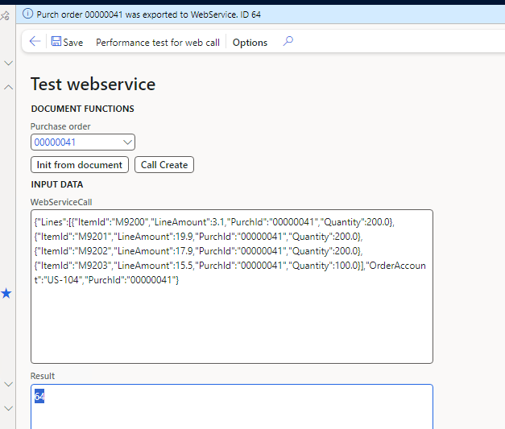
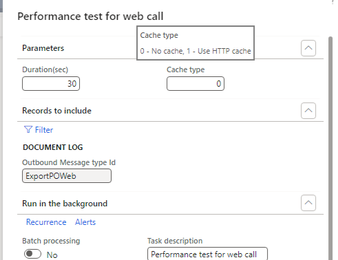

# Operations forms

These are the forms and periodic operations that users and support engineers work with daily.

## Incoming messages

*Form: `DEVIntegMessageTable`*

The message log — one record per inbound file, queue item, or API response, with the original payload attached.

Every message has a status:

- **Ready** — loaded into D365FO and waiting for processing.
- **In process** — system status while a message is being processed.
- **Processed** — completed successfully.
- **Error** — failed validation or processing; the error log is stored on the message.
- **Cancel** — a user decided not to process the message (the alternative to deleting). In early versions this status was called *Hold*.

From this form you can:

- download the original payload (**Download file**),
- view the detailed error log and the staging data parsed from the message,
- reprocess a message by resetting its status,
- open the document that was created from the message,
- view processing statistics — duration, time, number of lines.

A **Processing attempts** counter increments on every failed attempt; the processing batch job can filter on it to stop retrying messages nobody is fixing, while still allowing automatic recovery when missing data (like a customer record) appears later.

The goal state for a support team: every message ends as either **Processed** or **Cancelled**.

## Load messages

*Periodic operation*

A batch job that connects to the source defined by one or more inbound message types, creates *Incoming messages* records with the payload attached, and (for file channels) moves files to the Archive folder. With **Run processing** enabled it processes the loaded messages immediately.

For web-service sources the dialog shows the **Transaction time** (last loaded timestamp), which you can override to reload data from a specific period.

## Process incoming messages

*Periodic operation*

Selects all unprocessed messages and calls the processing class for each. Parallel processing (configured on the message type) splits the workload into batch threads. The dialog supports filtering, including by **Processing attempts**.

## Manual load

Processes a payload pasted as text (or uploaded as a file) exactly as if it came from the connector — no external system required. Messages created this way are marked *Manual* in the message log.

This is the framework's main testing and troubleshooting tool: a developer can reproduce any production issue in a dev environment from the message payload alone. See it in action in the [sales order import tutorial](https://denistrunin.com/integration-inboundwebsales).

## Service test

*Form: `DEVIntegServiceTest`*

Runs any registered [service message type](./setup/service-message-types.md) inside D365FO. The form auto-generates an input contract for the class — fill in the parameters and press **Execute** to see the response, without Postman or any external tool.

## Manual test (outbound)

For event-based exports, the sample **Manual test** form (`DEVIntegTutorialTestWebCall` in the Samples model) can build the payload for any document (**Init from document**), display it without sending, and perform a real call with edited data (**Call Create**).

## Performance test

*Periodic operation (`DEVIntegExportDocumentPerfTest`)*

Measures export throughput: it takes a query filter over the *Export document log* and processes matching records in a loop for a given **Duration**, either reusing one connection or creating a new one per line — which quickly shows the cost of connection setup and authentication.

For inbound scenarios, the framework's parallel processing has been tested with [1 million ledger journal lines](https://denistrunin.com/xpptools-fileintegledgerperf).
