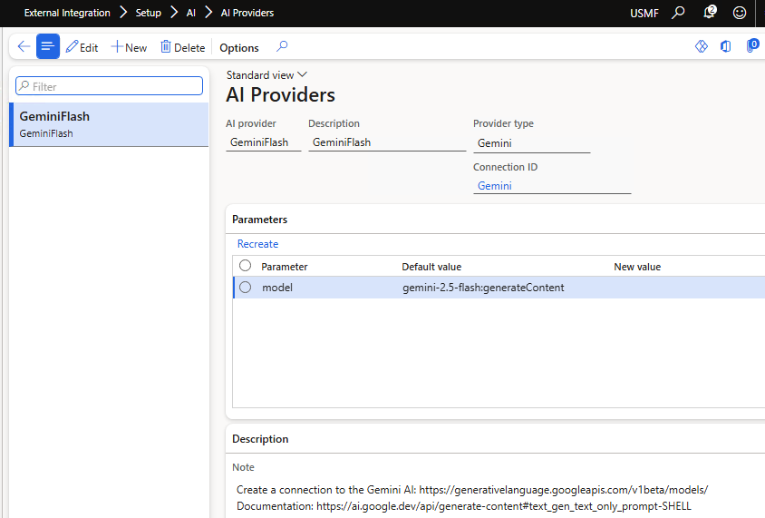
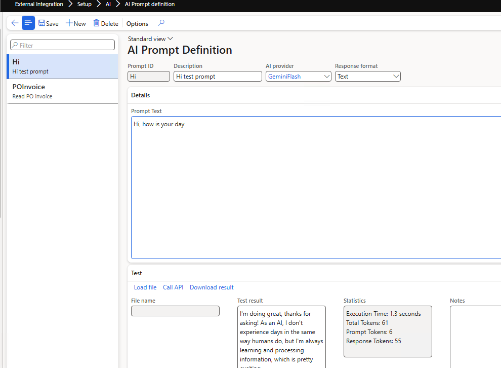

# AI providers

AI-based document recognition (for example, parsing PDF invoices) is configured with two forms: **AI providers** defines *which* model to call, and **AI prompt definitions** defines *what* to ask it.

## AI providers form

*Form: `DEVIntegAIProvider` — External integration → Setup → AI providers*

Registers AI/LLM providers. A provider is a class extending `DEVIntegAIProviderBase` that defines its parameters (such as the model name), a setup description, a connection reference holding the endpoint and API key, and the API call itself. The current implementation ships with a Google Gemini provider (`DEVIntegAIProviderGemini`).

The endpoint and API key are stored as a regular [connection type](./connection-types.md).

## AI prompt definitions form

*Form: `DEVIntegAIPromptDefinition` — External integration → Setup → AI prompt definitions*

Defines and validates the prompts used by AI-based imports. The **Call API** button runs the prompt against a test file, displays the response, and shows call statistics (tokens, duration) — so you can iterate on a prompt without running the whole integration.

A prompt is then linked to an [inbound message type](./inbound-message-types.md) whose processing class consumes the returned JSON.

## Related

- [AI (LLM) connector](../../connectors/ai-llm.md) — how the pieces fit together.
- Full tutorial: [Import purchase orders from PDF using AI](https://denistrunin.com/integration-importpurchpdf)
