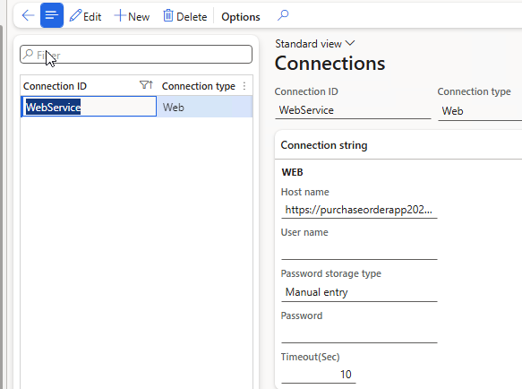

# Connection types

*Form: `DEVIntegConnectionType` — External integration → Setup → Connection types*

The central registry of external endpoints. Each record defines a channel — Azure File Share, Azure Service Bus, SFTP, Web service (REST), or an AI endpoint — with its host/URL, timeout, and credentials.

## Credential storage

Passwords and keys can be stored in three ways:

- **Manual entry** — an unencrypted string, suitable for development. It survives database restores.
- **Encrypted** — an encrypted value.
- **Azure Key Vault** — a link to the standard D365FO key vault entry, the most secure option for production.

## Servicing

A **Test connection** button validates the settings without running an integration — the first thing to try after a connectivity failure, before touching any message type.

For local testing scenarios you can create a *Manual* connection that requires no credentials at all; see the [Manual connector](../../connectors/manual.md).

## Related

- Connector-specific setup notes: [Azure File Share](../../connectors/azure-file-share.md), [Azure Service Bus](../../connectors/azure-service-bus.md), [SFTP](../../connectors/sftp.md), [REST / Web service](../../connectors/rest-web-service.md), [AI (LLM)](../../connectors/ai-llm.md).
