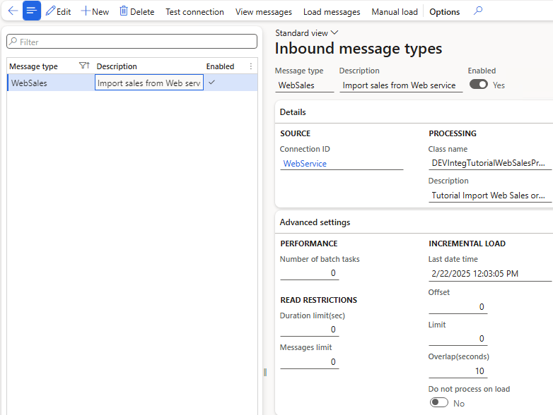

# Inbound message types

*Form: `DEVIntegMessageTypeInbound` — External integration → Setup → Inbound message types*

Describes one inbound integration: where messages come from and which class processes them.

## Key sections

- **Details / Connection details** — the linked [connection type](./connection-types.md), source folder or queue (plus Archive folder for file-based channels), and the processing class. The class extends `DEVIntegProcessMessageBase` and implements one method, `processMessage` — see [Inbound message type](../../message-types/inbound.md).
- **Incremental load** (for web-service sources) — *Last date time* used for the next request, *Overlap (seconds)* to avoid missing late commits, and *Offset*/*Limit* for paging.
- **Operation parameters** — parameters specific to the processing class (for example, ledger journal name, post yes/no, file type). Each processing class defines its own.
- **Advanced settings** — parallel processing thread count and archive file naming.

## Servicing

- **Check connection** verifies access to the source.
- **Import file** loads a file manually from the user's computer — the standard way to test a new integration without a live connector.

## Related

- [Incoming messages](../operations.md#incoming-messages) — where loaded messages appear.
- [Load messages](../operations.md#load-messages) and [Process incoming messages](../operations.md#process-incoming-messages) — the periodic operations driven by this setup.
