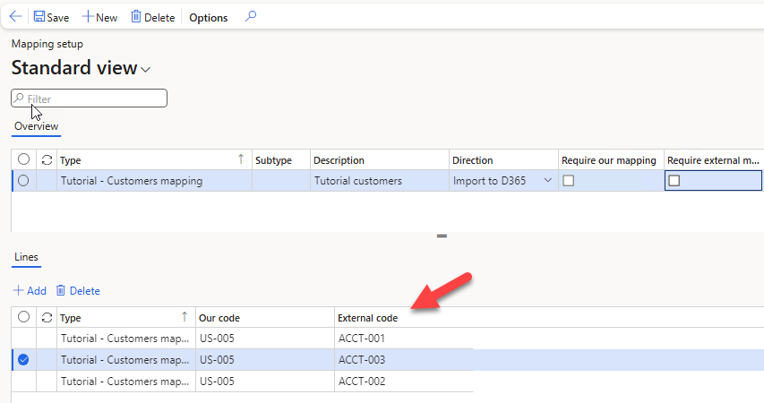

# Mapping setup

*Form: `DEVIntegMappingTable` — External integration → Setup → Mapping setup*

A simple code-mapping table between external values and D365FO values — for example, mapping an external order account `ACCT-001` to customer account `US-001`. Processing classes look values up by mapping type.

## Usage notes

- Mappings are keyed by a mapping type, so one table serves any number of integrations without collisions.
- A missing mapping is a normal, recoverable data error: the message ends in *Error* status, a user adds the mapping, and the message is [reprocessed](../operations.md#incoming-messages) — no developer involvement needed.

## Related

- Tutorial with a worked mapping example: [Import sales orders from an external web application](https://denistrunin.com/integration-inboundwebsales)
