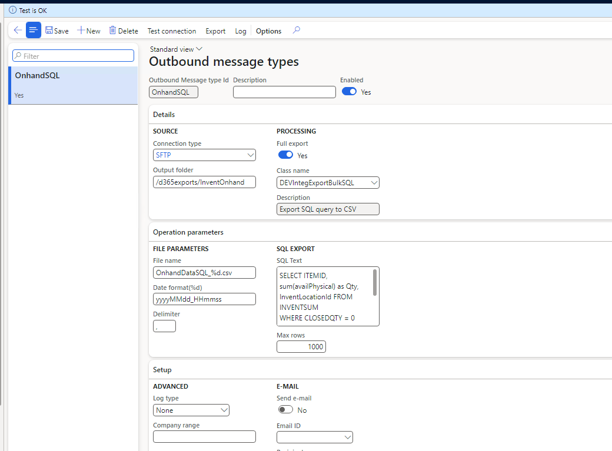

# Outbound message types

*Form: `DEVIntegMessageTypeTableOutbound` — External integration → Setup → Outbound message types*

Describes one outbound integration — either **Periodic** (bulk) or **Document on event**.

## Key settings

- **Source** — the [connection type](./connection-types.md) and target folder (e.g. on the SFTP server).
- **Processing** — the export class, extending `DEVIntegExportBulkBase` (a `RunBaseBatch` subclass) for bulk exports or `DEVIntegExportMessageBase` for event-based documents. Simple bulk cases can run a plain SQL statement or a data entity query with **no code** via `DEVIntegExportBulkSQL` — see [Outbound samples](../../document-types/outbound-samples.md).
- **File parameters** — file name template with a `%d` date placeholder (formatted using .NET `DateTime.ToString` rules) and a CSV delimiter.
- **Advanced** — log detail level and a *Company range* restricting which companies the export runs in.

## Servicing

- **Export all** performs an initial export of existing documents through a standard query dialog — used when going live with an event-based integration on a database that already contains documents.
- **Test connection** validates the channel.

## Related

- [Export document log](../logs.md#export-document-log) — event-based export tracking.
- [Export log](../logs.md#export-log-bulk) — bulk export run history.
