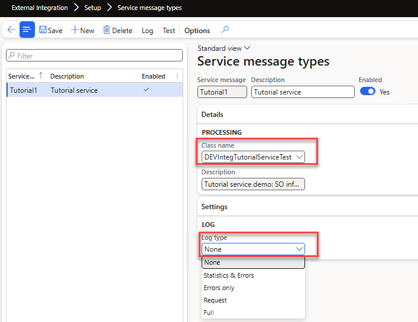

# Service message types

*Form: `DEVIntegMessageTypeService` — External integration → Setup → Service message type*

Registers synchronous X++ service classes (extending `DEVIntegServiceExportBase`) so they get standard logging and can be tested from the UI.

## Key settings

- **Service class** — the X++ class implementing the service; see [Service-based message types](../../message-types/service.md) for the development pattern.
- **Logging** — per-service log level, from statistics-only to full request/response; the levels are described under [Service call log](../logs.md#service-call-log).

## Servicing

The **Test** button opens the [Service test form](../operations.md#service-test) with an auto-generated contract for the selected class — you can execute the service with real parameters without any external tool.

## Related

- Tutorial: [Implement service-based integration in D365FO](https://denistrunin.com/integration-services)
