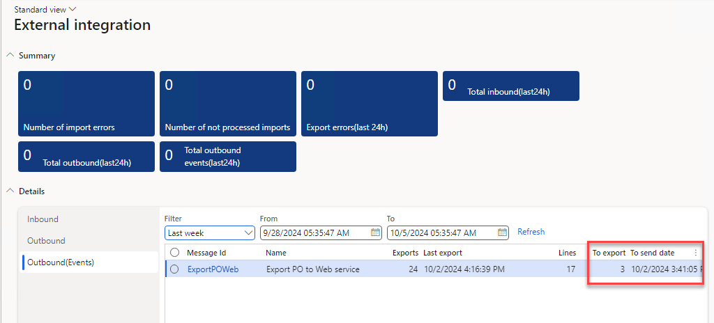

# Monitoring workspace

*Form: `DEVIntegWorkspace`*

The **External Integration workspace** is the single monitoring dashboard for all integrations built with the framework.

It combines:

- **KPI tiles** — count of inbound messages in *Error* status, messages not processed yet, and outbound documents not exported (`DEVIntegWorkspaceMessageErrorTile`, `DEVIntegWorkspaceMessageNotProcessedTile`, `DEVIntegWorkspaceExportMessageErrorTile`).
- **Session lists** — recent import sessions, full (bulk) export sessions, and incremental export sessions for a selected period, with volumes and durations (`DEVIntegWorkspaceImportSessionsFormPart`, `DEVIntegWorkspaceExportFullSessionsFormPart`, `DEVIntegWorkspaceExportIncSessionsFormPart`).

A support engineer opens this workspace in the morning and immediately sees which interface needs attention; every tile drills down to the corresponding [message log](./operations.md#incoming-messages) or [export log](./logs.md).

For alerting outside D365FO, combine the workspace with standard alert rules on the underlying tables — for example on message status *Error*, on the *Processing attempts* counter, or on an outdated *Last date time* of an incremental load. Typical monitoring setups are described in the [event-based export tutorial](https://denistrunin.com/integration-outboundweb) and the [sales order import tutorial](https://denistrunin.com/integration-inboundwebsales).
