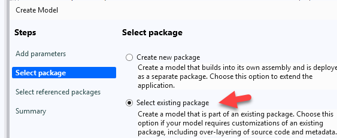
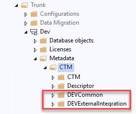

# Getting started

## Prerequisites

- A D365FO development environment (cloud-hosted or local VHD).
- Access to the [TrudAX/XppTools](https://github.com/TrudAX/XppTools) GitHub repository — the framework is free and open source, no licence keys required.

## The models

The framework consists of the following models, located in the `DEVTutorial` folder of the repository:

| Model | Install | Purpose |
|---|---|---|
| `DEVCommon` | Yes | Shared helpers (file readers, dimension helpers). |
| `DEVExternalIntegration` | Yes | The External Integration framework itself. |
| `DEVExternalIntegrationSamples` | No — reference only | Tutorial implementations used by the step-by-step guides. Use it as a code reference or in a throwaway dev environment; **do not include it in a client database**. |

## Installation

Download the source code from the [GitHub repository](https://github.com/TrudAX/XppTools) into the Temp directory on the DEV VM.

For External integration, the recommended approach is to create **submodels in your main project model**:

1. In Visual Studio, go to **Dynamics 365 → Model Management → Create model**.

2. Create 2 models, **DEVCommon** and **DEVExternalIntegration**, for your main project package.

   

3. Copy all content from the downloaded models. The project structure should look like this:

   

4. Build the models and synchronize the database. After the build, a new **External integration** module appears in the D365FO navigation pane, with **Setup**, **Inquiries**, and **Periodic** sections.

:::note
If you want to rename the `DEV` element prefix to your own, use a bulk file renaming tool (e.g. Bulk Rename Utility) on the XML files, followed by *Replace in files* in Notepad++.
:::

## Run a first test import

The fastest way to see the framework working is the ledger journal tutorial, which needs no external connector. It uses the `DEVIntegTutorialImportLedgerJournal` class from the Samples model — copy that class (or the whole Samples model, in a dev environment only) to follow along:

1. Open **External integration → Setup → Connection types** and create a *Manual* connection (no credentials needed).
2. Open **External integration → Setup → Inbound message types**, create a message type with the processing class `DEVIntegTutorialImportLedgerJournal`, and set its operation parameters (journal name, file type).
3. Use the **Import file** button to upload one of the [test files provided in the repository](https://github.com/TrudAX/XppTools/blob/master/assets/TestPeriodicLedgerJournalImport.zip) (prepared for the standard Contoso demo data).
4. Check the result in **Incoming messages**: the message should reach the *Processed* status with a link to the created journal, staging data, and processing statistics.

The full walk-through, including error-handling scenarios, is in the tutorial: [How to implement file-based integration in D365FO using X++](https://denistrunin.com/xpptools-fileintegledger).

:::tip
Every inbound message type has an **Import file** button and a **Manual load** function — you can develop and test any integration end-to-end in a dev environment without access to the real external system. See [Operations forms](./forms/operations.md).
:::

## Next steps

- Read the [forms reference](./forms/setup/index.md) to understand the setup options.
- Pick the [connector](./connectors/index.md) and [message type](./message-types/index.md) closest to your scenario and follow its tutorial.
- Review the [integration design checklist](https://denistrunin.com/integration-checklist) before designing a production interface.
