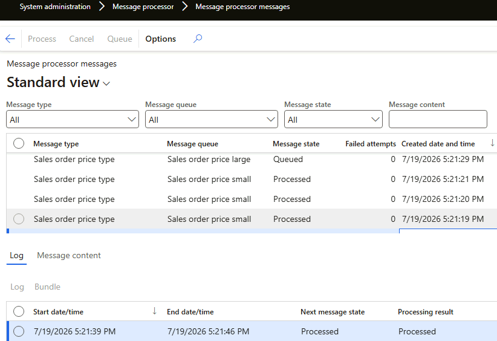

# vs Message Processor

The standard [Message Processor](https://learn.microsoft.com/en-us/dynamics365/supply-chain/message-processor/message-processor) framework is conceptually very similar to External Integration — both are message-based processing engines. The difference is in the details that matter for real-life usage: the External Integration framework contains a set of improvements that simplify day-to-day operation and troubleshooting.

The standard **Message processor messages** form even looks very similar to External Integration — until you try to use it and realize, for example, that there is no message ID on the form.

Message Processor groups messages into **bundles**: the idea is that linked messages should be processed in sequence. However, the implementation is quite complex and creates its own limitations — you can't process a message in a transaction, bundles may wait for each other, and so on. More details in the table below.

| Capability | Message Processor | External Integration |
|---|---|---|
| **Batch tasks** | 8 max | ✅ Unlimited — specify any number of parallel threads; D365FO batch management handles thousands of threads in practice |
| **Logging** | `CreatedDate` in the header, start and end dates in lines. No information about the number of lines for a particular message | ✅ Start date, end date, and **Duration (seconds)** in the header — filter and sort by them to find the longest messages during a test phase. For a multiline message, line statistics: processed items, skipped lines, items with errors |
| **Tracing** | None — even the message ID is not visible on the form. Full-text search over message content depends on full-text index updates | ✅ Trace a message to the individual resulting lines. When a user asks "why was the price updated with this number?", go from the record straight to the linked message and analyse it |
| **Manual message processing** | Not supported — you need to call the service via Postman | ✅ Copy any message text, modify it, and process it from the UI ([Manual load](../forms/operations.md#manual-load)); the message is marked *Manual* for tracing. Copy a message from TEST and run it on DEV using standard D365FO forms, no external tools |
| **Testing in a `ttsbegin`-`ttsabort` block** | Not supported — `SysMessageProcessor` creates bundles via a separate connection, not visible when an outer transaction is present | ✅ Supported — processing is just a class call |
| **Cancel function** | Cancel is an end state; the Process button is disabled for cancelled messages | ✅ Cancelled messages can be reprocessed (case: you selected the wrong record). Cancellation accepts a free-text **Cancel reason** (case: "why was this record cancelled, and by whom?") |
| **Processing flexibility** | Can't filter by message fields (e.g. status) in batch — only the message type in the batch dialog, or the form's Process button without batch | ✅ Filter by any field of the message table — e.g. *"process all errors from yesterday with fewer than 2 attempts"*. Limit the number of messages per batch or the batch duration — e.g. process exactly 100 messages and measure the time |
| **Format** | JSON only | ✅ Text in any format — JSON, XML, CSV — or a file. See [File formats](../file-formats/index.md) |

## Summary

If Message Processor's constraints fit your scenario, it is a supported standard tool. External Integration applies the same message-based concept with the operational features — logging, tracing, manual processing, flexible reprocessing — that support teams end up needing in production.
